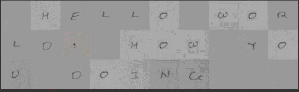

# Type-in-your-own-handwriting
The program that will help you to write text in your own handwriting by uploading a single text file. This text file will contain the content you want to write. 

Input:

1) Write all the aplhabets, numbers and special charecters that you will require for the code that you want to write for you with each image named with what it contains. for ex an image with an a should be names a.jpg.

2) abc.txt is the input text file whos output you need to convert to your handwriting.

